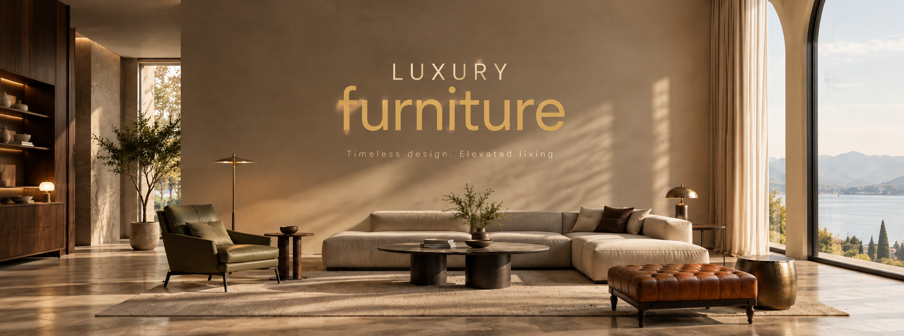
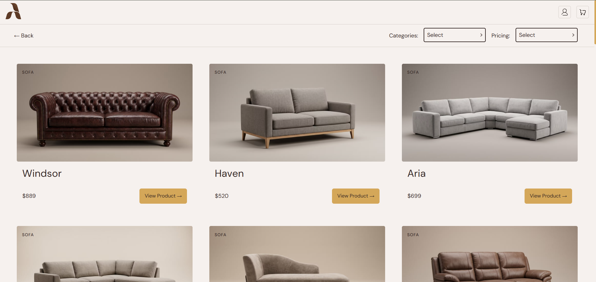
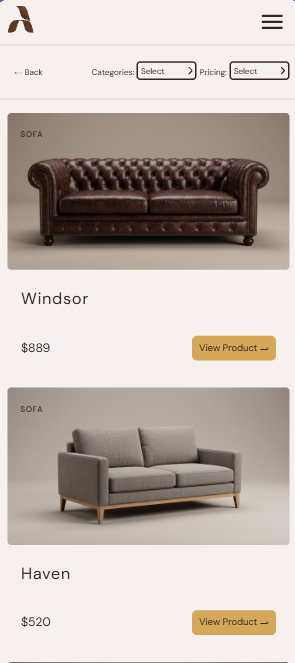

<div align="center">



<br />

# 🛋️ AERA

### AERA — The Shape of Living.

A modern and responsive e-commerce application built with React that provides
different furniture with profile creation.

<br />

[](https://aera-gamma.vercel.app/)
[](https://github.com/Hassan-src/AERA)

</div>

---

## ✨ Overview

**AERA** is a React-based e-commerce application designed to provide users
with furnitures.

The application allows users to explore different categories of furnitures:

- All products
- Sofas
- Chairs
- Tables

The project focuses on building a polished frontend experience while
practicing redux, react router, reusable components, custom hooks, and responsive design.

---

## 🛠️ Tech Stack

<div align="center">

### Frontend


### Tooling


</div>

### Technologies

| Technology       | Purpose                                   |
| ---------------- | ----------------------------------------- |
| ⚛️ React         | UI development and component architecture |
| 🟨 JavaScript    | Application logic                         |
| 🌐 HTML5         | Semantic structure                        |
| 🎨 CSS3          | Styling and responsive layouts            |
| 🧭 React Router  | Client-side routing and navigation        |
| 🔄 Redux Toolkit | Global state management                   |
| ⚡ Vite          | Development server and production build   |
| 🔍 ESLint        | Code quality and linting                  |
| 🐙 Git & GitHub  | Version control                           |

---

## 🏗️ React Architecture

The application uses reusable React components and separates responsibilities
between:

- UI components
- Custom hooks
- Redux
- Application state

This architecture keeps the application modular and makes individual parts
easier to maintain and extend.

---

## 🖼️ Preview

### Desktop



### Mobile & Tablet



---

## 📱 Responsive Design

AERA is designed to work across different screen sizes.

The interface adapts to:

- 🖥️ Desktop
- 💻 Laptop
- 📱 Mobile
- 📟 Tablet

Responsive design is implemented using CSS media queries, flexible layouts,
and responsive components.

---

## ⚡ Error States

Network requests can take time or fail, so AERA provides appropriate
application states.

### Error

If the request fails, the application provides
an appropriate error state instead of leaving the interface blank.

---

## ♿ Accessibility

Accessibility was considered throughout the interface.

The project aims to provide:

- Semantic HTML
- Accessible form controls
- Visible interactive states
- Appropriate text contrast
- Responsive layouts
- Clear error feedback
- Meaningful labels

---

## 📂 Project Structure

```text
aera/
│
├── public/
│
├── src/
│   ├── data/
│   │   ├── product.js
│   │   ├── ShippingReturnsIds.js
│   │   └── Slider.js
│   │
│   ├── features/
│   │   ├── cart/
│   │   │   └── cartSlice.js
│   │   └── store.js
│   │
│   ├── hooks/
│   │
│   │
│   ├── Pages/
│   │   ├── Care Instructions/
│   │   ├── Cart/
│   │   ├── Collection/
│   │   ├── Contact Us/
│   │   ├── CraftsmanShip/
│   │   ├── FAQ/
│   │   ├── Home/
│   │   ├── LearnOurStory/
│   │   ├── Product/
│   │   ├── Profile/
│   │   ├── Shipping & returns/
│   │   ├── Sustainability/
│   │   └── Warranty/
│   │
│   │
│   ├── ui/
│   │   ├── Cart/
│   │   ├── Collection/
│   │   ├── Error/
│   │   ├── Footer/
│   │   ├── Header/
│   │   ├── Home/
│   │   ├── Profile/
│   │   ├── AppLayout.jsx
│   │   ├── AppLayout.module.css
│   │   └── Button
│   │
│   ├── utils/
│   │   ├── ProfileAction.js
│   │   ├── ProfileLoader.js
│   │   └── ScrollToTop.js
│   │
│   ├── App.jsx
│   ├── index.css
│   └── main.jsx
│
├── .gitignore
├── eslint.config.js
├── index.html
├── package.json
├── vite.config.js
└── README.md
```

---

## 📦 Installation

### 1. Clone the repository

```bash
git clone https://github.com/Hassan-src/AERA
```

### 2. Navigate to the project

```bash
cd aera
```

### 3. Install dependencies

```bash
npm install
```

### 5. Start the development server

```bash
npm run dev
```

The application will then be available at the local development URL
provided by Vite.

---

## 🔮 Future Improvements

The current version focuses on the core e-commerce experience.

Possible future improvements include:

- 🛋️ More furniture categories
- 📥 Dedicated API

---

## 📚 What I Learned

Building AERA helped me strengthen my understanding of:

- ⚛️ React component architecture
- 🪝 Custom React Hooks
- 🧠 Redux
- 🔄 Asynchronous JavaScript
- ⏳ Loading and error states
- 🔄 Conditional rendering
- 📱 Responsive CSS
- 🧩 Component composition
- 🗂️ Project organization
- ⚡ Vite development workflow
- 🔍 ESLint and code quality
- 🎨 Modern UI development

---

## 🎯 Project Goals

The primary goals were to practice:

```text
React
  ↓
Component Architecture
  ↓
State Management
  ↓
Custom Hooks
  ↓
Redux
  ↓
Async Data
  ↓
Loading & Error States
  ↓
Responsive UI
```

The project focuses on applying these concepts together to create a
complete, maintainable frontend application.

---

## 🚀 Deployment

AERA is deployed using Vercel.

### Live Application

https://aera-gamma.vercel.app/

### GitHub Repository

https://github.com/Hassan-src/AERA

---

## 🤝 Contributing

Contributions, suggestions, and improvements are welcome.

### Fork the repository

```bash
git clone https://github.com/Hassan-src/AERA.git
```

### Create a feature branch

```bash
git checkout -b feature/your-feature
```

### Commit your changes

```bash
git add .
git commit -m "Add your feature"
```

### Push your branch

```bash
git push origin feature/your-feature
```

Then open a Pull Request.

---

## 🐛 Issues & Suggestions

If you find a bug or have a suggestion for improving AERA,
feel free to open an issue on GitHub.

**GitHub Repository:**

https://github.com/Hassan-src/AERA

---

## 🌐 Links

### 🚀 Live Demo

https://aera-gamma.vercel.app/

### 💻 Source Code

https://github.com/Hassan-src/AERA

### 🐙 GitHub

https://github.com/Hassan-src

---

## 👨‍💻 Developer

### Hassan Esmaeilpour

Frontend Developer passionate about building clean, interactive,
responsive web applications with React.

---

## ⭐ Support

If you like this project, consider giving the repository a ⭐ on GitHub.

---

<div align="center">

### 🛋️ AERA

**AERA — The Shape of Living.**

Built with ❤️ using React.
